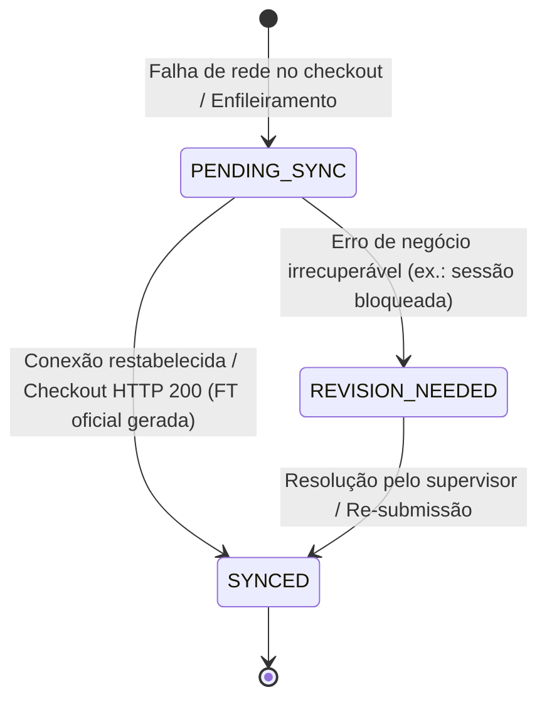

# Especificação Canónica — Modo de Contingência & Resiliência Local no POS (Offline-First Leve)

**Código:** SPEC-PCR-001  
**Versão:** 1.0.0  
**Data:** 2026-09-17  
**Módulos Envolvidos:** `contracts`, `backend`, `desktop`

---

## 1. Objectivo de Negócio
Garantir continuidade ininterrupta das operações de balcão e retalho no POS do Multicore ERP em caso de indisponibilidade de rede, falha de infraestrutura ou quebra de comunicação com o servidor central.

O operador de caixa não deve ser forçado a bloquear a fila ou dispensar clientes sem documento de venda quando ocorrem falhas de comunicação transitórias.

---

## 2. Princípios e Regras Invioláveis

1. **Fila Local Durável e Atómica (PCR-R01):**
   - Vendas efectuadas em contingência são persistidas atomicamente em formato JSON estruturado (`pos_contingency_queue.json`) no directório local de dados do utilizador (`%LOCALAPPDATA%/MulticoreERP/data` ou `~/.multicore/data`).
   - A gravação resiste a encerramento forçado da aplicação ou quebra de energia.

2. **Talão Provisório de Caixa (PCR-R02):**
   - O talão impresso no acto da venda em contingência possui cabeçalho explícito:  
     `TALÃO PROVISÓRIO DE CAIXA (REGIME DE CONTINGÊNCIA)`.
   - Contém advertência legal e regulamentar:  
     `AVISO FISCAL: DOCUMENTO EMITIDO EM CONTINGÊNCIA. AGUARDA SINCRONIZAÇÃO COM O SERVIDOR. NÃO DISPENSA FATURA OFICIAL`.
   - É impresso de forma nativa e assíncrona através de `PosThermalReceiptPrinter` (`java.awt.print.Printable`), respeitando a proibição absoluta de composição de PDF com bibliotecas externas no cliente Swing.

3. **Idempotência Fiscal no Backend (PCR-R03):**
   - Toda a venda em contingência transporta uma chave única imutável:  
     `CONT-YYYYMMDD-HHMMSS-XXXX` (onde `XXXX` é um sufixo pseudo-aleatório seguro).
   - O motor `POSService.checkout` no backend valida se a referência de contingência já existe na tabela `invoices` para a empresa activa.
   - Em caso afirmativo, devolve imediatamente o documento oficial já gerado sem gerar nova numeração sequencial `FT` e sem duplicar movimentação de tesouraria ou saídas de stock (idempotência estrita).

4. **Sincronização Bidireccional (Automática e Manual) (PCR-R04):**
   - Um serviço em background (`PosContingencySyncService`) executa a cada 45 segundos e tenta sincronizar pendências em ordem cronológica (FIFO).
   - O operador possui indicador visual na interface do POS:  
     `[ ⚠️ Contingência (X) ]` exibindo a contagem e acedendo ao diálogo de inspecção e sincronização forçada com 1 clique.

5. **Isolamento e Limite de Linhas (PCR-R05):**
   - O painel principal `POSPanel.java` delega toda a complexidade de persistência, diálogo e impressão para componentes especializados (`PosContingencyManager`, `PosContingencyDialog`, `PosThermalReceiptPrinter`, `PosCartItem`), mantendo-se estritamente abaixo do limite de 1000 linhas.

---

## 3. Estados do Ciclo de Vida da Contingência



---

## 4. Contratos de Dados

```java
public record POSCheckoutRequest(
    String operator,
    Long companyId,
    Long clientId,
    String walkInName,
    Long warehouseId,
    Long treasuryAccountId,
    List<POSCheckoutLineRequest> lines,
    List<PosPaymentRequest> payments,
    String contingencyReference // Novo campo opcional
) {}
```
