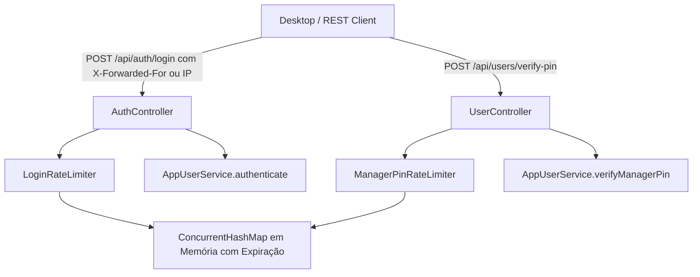

# Especificação: Rate Limiting e Proteção contra Força Bruta Transversal (SPEC-SEC-RL-001)

**Actualização de segurança (2026-10-03):** a chave de utilizador é agora `(username, IP de origem)`;
uma origem não pode bloquear a mesma conta para outras origens. As entradas expiradas são removidas e
o armazenamento tem limite fixo. `X-Forwarded-For` só é aceite do proxy confiável configurado. Esta
Esta regra aplica-se a toda a especificação. Ver
[SECURITY_ATTACK_SURFACE_REMEDIATION_SPEC.md](SECURITY_ATTACK_SURFACE_REMEDIATION_SPEC.md).

## 1. Visão Geral e Princípios Fundamentais

Esta especificação define o padrão arquitetural de **Rate Limiting e Proteção Ativa contra Ataques de Força Bruta e Adivinhação de Credenciais** em todo o sistema Multicore ERP.

A segurança é estruturada segundo os princípios **SOLID**, **DRY** e **Defesa em Profundidade**:
1. **Proteção Bi-Fatorial no Login:**
   - **Nível Utilizador e Origem:** Impede adivinhação de palavra-passe para um utilizador a partir da mesma origem (máximo de 5 falhas consecutivas, com bloqueio temporário de 15 minutos).
   - **Nível IP do Cliente:** Impede ataques de força bruta horizontal (*credential stuffing* / varredura de múltiplos usernames a partir da mesma máquina/IP, com bloqueio temporário após 30 falhas).
2. **Proteção Rigorosa de PIN de Gerente (POS & Anulações):**
   - Como o PIN de autorização de supervisor possui apenas 4 dígitos decimais (espaço amostral de 10.000 combinações), é estritamente proibido permitir tentativas contínuas sem trava.
   - Máximo de **3 tentativas consecutivas falhadas** por empresa/origem -> Bloqueio imediato de 5 minutos.
3. **Transparência e Ergonomia Operacional:**
   - Respostas amigáveis em português de Moçambique informando o tempo restante de bloqueio em minutos.
   - Sucesso em qualquer etapa zera e restabelece os contadores da respetiva chave.
   - Relógio configurável e desacoplado (`Clock` ou injeção) para permitir testes unitários determinísticos de TDD sem esperas temporais lentas.

---

## 2. Parâmetros e Políticas de Bloqueio

| Endpoint / Operação | Chave de Limite | Tentativas Máximas | Duração do Bloqueio | Mensagem de Violação |
| :--- | :--- | :--- | :--- | :--- |
| **`/api/auth/login` (Username e origem)** | `user:<username_lowercase>:<client_ip>` | 5 falhas seguidas | 15 minutos | `"Demasiadas tentativas falhadas. Tente novamente em X minuto(s)."` |
| **`/api/auth/login` (IP)** | `ip:<client_ip>` | 30 falhas seguidas | 15 minutos | `"Demasiadas tentativas de autenticação a partir deste endereço IP. Tente novamente em X minuto(s)."` |
| **`/api/users/verify-pin`** | `pin:<companyId>:<client_ip>` | 3 falhas seguidas | 5 minutos | `"Demasiadas tentativas de PIN incorreto. Bloqueado por X minuto(s) para protecção de segurança."` |

---

## 3. Arquitetura em Camadas

---

## 4. Tratamento Fail-Safe e Integração Desktop

- O frontend Desktop captura a mensagem de bloqueio e apresenta-a através de [InlineFeedbackPanel.java](file:///c:/Users/miran/Desktop/manager/desktop/src/main/java/mz/multicore/erp/gui/components/InlineFeedbackPanel.java) ou [ModernMessageDialog.java](file:///c:/Users/miran/Desktop/manager/desktop/src/main/java/mz/multicore/erp/gui/components/ModernMessageDialog.java) sem travar a interface.
- Em caso de bloqueio de PIN no POS (ex.: ao tentar anular linha ou conceder desconto fora da alçada), a caixa de diálogo de PIN desativa o campo e notifica o operador claramente.
